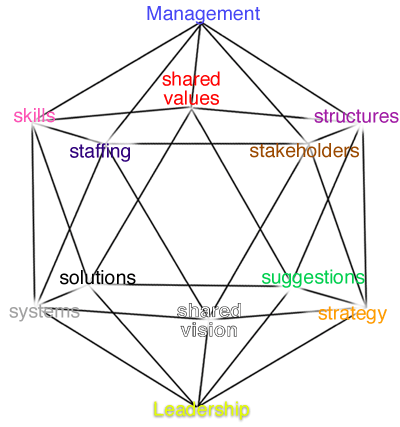


<!--  Add content here   Add content here   Add content here -->
<!--  Add content here   Add content here   Add content here -->

<h3>2121: A preface to exploring the future.</h3>


The Asia Pacific Regional NGO consultation on "Our Cities, Our Homes" was held in Kuantan, Malaysia in 1995. Citizen organisations and networks representing a diverse range of interests produced a statement of a common vision of a world of socially just, ecologically sustainable, politically participatory, economically productive, and culturally vibrant communities in which all people live productive lives and prosper in peace and harmony. The organisations involved included those concerned with the environment, health, media and communications, youth, children, women's development, housing, consumers, human rights and development 



In 1996 another group of diverse people met in the Global Strategy Centre at Monash Mt Eliza Business School in Australia. They hoped to extend that set of "shared values" into the future - to develop a "shared vision" of the preferred and desired world of the year 2121. In her opening remarks, Jane Shelton, one of the younger participants who collectively organised the Conference set out the expectations as:


<ol>
	<li>A meeting of minds concerned about the future</li>
	<li>New ideas and experiences beyond our conventional lifetimes, and</li>
	<li>An extended network of shared values and vision.</li>
</ol>



This initial Conversation with the Future builds on two diverse sets of logic - that of the Western Mind of Socrates, and the Eastern Mind of Sun Tzu.  It takes the view that "knowing the terrain and knowing oneself" are vital life support measures calculated to ensure both global survival and personal growth.



This summary cannot hope to represent the richness of that dialogue. It merely draws out a sample of the ideas that were considered in each of twelve jumping off points to encourage further awareness, involvement and motivation to create our preferred and desired futures.



The 2121 Forum was designed as a dialogue, a continuing conversation with the future.  Representatives of the various interest groups on the planet were asked to discuss and construct the environment and search out other futures. The agenda developed by Donna Benjamin and Adam Richard asked the sixty participants to

 

"enter your spaceships and secure your seatbelts warpspeed and meet your co-pilots, question, explore and design a desired future - dream imagine and envision the picture of your future world"

   

The Horizons Network Pty Ltd, run and directed by these young people, wanted people to map out pathways, talk, explain and discover and then beam back to the planet earth of 1996 against <a href="habitat.html">The People's Agenda</a> set in Malaysia


<ul>
	<li>"Our Cities, Our Homes."</li>
	<li>socially just</li>
	<li>ecologically sustainable</li>
	<li>politically participatory</li>
	<li>economically productive</li>
	<li>culturally vibrant"  </li>
</ul>


The Network has developed orgware and decision support systems that ensure an integrated, global perspective to this dialogue process based on the principles of the Soccerball- 12 integrated spheres of discussion linking the common goals and values of the participants in a lifelong conversation. 



Each participant was "posted" to one of the twelve jumping off points of the icosa star for an initial encounter with the preferred and desired world of 2121.


 
<!--
[[img src="10sIcosa.gif" width="400" height="430" border="0" align="middle" usemap="#Map" /]]
-->

<map name="Map">
<area shape="rect" coords="143,2,267,26" href="#Strategic_Management">
<area shape="rect" coords="160,71,224,108" href="#Shared_Values">
<area shape="rect" coords="10,105,58,126" href="#Skills">
<area shape="rect" coords="313,106,399,126" href="#Structures">
<area shape="rect" coords="66,137,137,163" href="#Staffing">
<area shape="rect" coords="246,140,362,160" href="#Stakeholders">
<area shape="rect" coords="56,264,139,290" href="#Solutions">
<area shape="rect" coords="171,295,243,344" href="#Shared_Vision">
<area shape="rect" coords="259,269,371,290" href="#Suggestions">
<area shape="rect" coords="316,303,390,324" href="#Strategies">
<area shape="rect" coords="149,396,257,423" href="#Strategic_Leadership">
<area shape="rect" coords="7,302,88,323" href="#Systems">
</map> 

Caryl Macleod of Cronos Consulting Training Council has supplied definitions of these dozen platforms for conversation - the Twelve 'S' model that looks to designing a future rather than managing a past. A conversation has neither a beginning nor an end if it is taken as a developing dialogue with future generations. We have time to shape tomorrow by sharing our needs,  hopes, wants and expectations to reach the 2121 agenda.


<table width="400" cellspacing="4" cellpadding="4" align="center">
	<tr align="center">
		<td> </td>
		<td align="center"><a href="#Strategic_Management">Strategic Management</a></td>
		<td> </td>
	</tr>
	<tr align="center">
		<td><a href="#Staffing">Staffing</a></td>
		<td> </td>
		<td><a href="#Stakeholders">Stakeholders</a></td>
	</tr>
	<tr align="center">
		<td><a href="#Skills">Skills</a></td>
		<td><a href="#Shared_Values">Shared Values</a></td>
		<td><a href="#Structures">Structures</a></td>
	</tr>
	<tr align="center">
		<td><a href="#Systems">Systems</a></td>
		<td><a href="#Shared_Vision">Shared Vision</a></td>
		<td><a href="#Strategies">Strategies</a></td>
	</tr>
	<tr align="center">
		<td><a href="#Solutions">Solutions</a></td>
		<td> </td>
		<td><a href="#Suggestions">Suggestions</a></td>
	</tr>
	<tr align="center">
		<td> </td>
		<td><a href="#Strategic_Leadership">Strategic Leadership</a></td>
		<td> </td>
	</tr>
</table>

 


<h4>Strategic Management</h4>


The key process is that of promoting the "Principle of Requisite Variety" expressed through a variety of forms and "Environmental Responsiveness". Strategic Management can ensure that our thinking is directed towards the wisdom that is inherent in higher levels of complexity rather than the search for the diminishing returns of uninformed and media manipulated issues.


 
<h4>Shared Values</h4>


Australia must harness the collective genius of its people. The task or responsibility is to find a way to value the contribution that everyone can make - unleash the power and direct it for the common good. It is important to make our values explicit to be in charge of our destiny.



Values are something we all talk about, we own our own values and as a society we continuously revisit what our collective values are.



New and more diverse relationships offer the potential for individuals to develop, communicate, work, share, travel, explore on a scale not possible in 1996 and to re-balance their lifestyle to reflect a focus on spirituality, environment, land and personal productions.



There will be a borderless world in which there are many diverse cultures, and consequently many common cultural influences with a shared value system leading to stronger identification of our shared humanity, our mutual obligations, and a commitment to strengthening our local global environment and communities.


<h4>Structures</h4>


Local structures offer the chance for teamwork that maximises the contribution of individual people as the key global asset, encourages the involvement of women in society, a balance of the senses and minority growth.

Local community empowerment can support regional management and responsibilities for communication between local and across national structures that are based on the creation of a global forum for agreement on principles and philosophies that sustain social growth.

The process of affiliation, unity and identity can provide the framework in which to develop shared values and goals, provide inspirational leadership through the use of technology that enables individual goals. Growth in creativity is a tradable commodity - thereby freeing up communities from traditional services an products as a means of generating income.  Alliances are flexible, community based and formed on the basis of practical needs rather than ideology.  

To establish a legitimate structure it needs to be a bottom up global structure to produce leadership and direction; a regional structure for management and maintenance and a local structure for teamwork, affiliation and responsibility. 

The most significant change between 1996 and 2121 will be the emergence of relationships between firms, families and individuals without the constraints of national borders. Existing structures and authority systems which do not respond to individual creativity, cultural diversity, and the relationships they require, will be in conflict with the dynamic of the borderless world and will have to adapt, change or disappear. 


<h4>Stakeholders</h4>

Tolerance, quality of life and sustainable environment establish the pathway to change through a national dialogue between decision makers and the community at all levels for the 22nd century appreciation of difference.

Everyone, as an individual has a stake in encouraging full participation in developing continuous performing and learning systems that foster dialogue about shared values and vision for 2121. Stakeholders accept personal responsibility for the future of the planet as individuals through their involvement in social relationships, social networks and physical community.

We need to enable private ownership of wealth generation, encourage non-conformists and protect isolation, develop enabling technologies, establish responsibilities of government bodies for quarantine, transport ( logistics) and rule making through a global forum to agree principles and provide education.


<h4>Staffing</h4>

A Bill of Rights needs to be administered by an international body that approves procedures and structural advances, an international court that also fulfils the judiciary role of monetary governing body and is backed by an international peace keeping body appointed by "Wisdom". Unfair treatment is  presented as not experiencing a  sense of interdependence cooperation, nurturing and education in life skills / philosophy that enables informed participation by all "new members".  All governing bodies are required to  review the operation of reward and sanction systems to ensure congruence via conciliation/ mediation and representation processes that are  based on the "Starship Independence" Philosophy Statement for the Planet:

"We take it as self evident that all crew members will have equal access to equitable living conditions which will sustain the ship and create a viable future for the later generations of all species".


<h4>Skills</h4>
Three core clusters of skills are essential if the transition from 1996 to 2121 is to be achieved:

<ol>
	<li>Ability to "filter" cultural diversity perceiving difference, nuance, meaning and commonality curiosity and willingness to be open and an accepting, self confidence/ self awareness.</li>
	<li>Ability to "order" (make sense of) cultural diversity including analysis relevance and utility, integration into objectives and synergise-leverage diversity to gain objectives </li>
	<li>Ability to "thrive" amidst cultural diversity requiring the ability to plan/translate ideas into practicality, programs and projects, operate across scale (local, regional and global) strengthening inter-personal relationship development, and ability to maintain goal focus, exploit/optimise reciprocity, lateral thinking and specific skills for negotiation/delegation, team building and network development/alliances.</li>
</ol>
 
<h4>Strategies</h4>

Development of self and development of institutions globally will reflect strategies focussing on how to teach and how to learn, turning data into information, moving to knowledge- value added information with migration pathways to facilitate the evaluation of data through to wisdom and different dimensions being worked on together. Institutions will evolve around industry/ workplaces, educational institutions, health and wellbeing, family, the environment and justice for the future systems. The journey of all individuals is to migrate along the hierarchy of data->infomation-> knowledge-> perception->insight towards wisdom.


The core strategic objectives will have the goal of harmony, wisdom and justice based in seeking inspiration insight. Life is like the universe - everything connects: the individual is the focus  (for development, change etc) through cooperation; networks through self-directed responsibility, and connections through encouraging learning to learn, think and make decisions through these processes to maintain progress through the hierarchy.

The pathways offer a just, ecologically responsible and socially sustainable society giving each individual the opportunity to participate fully in all opportunities society offers.

 
 <h4>Suggestions</h4>

Our preferred future includes an Australia in which our citizens and children are reconnected with our rich environment and re-acquainted with a feeling of social responsibility and a sense of belonging through a series of ritualistic passage & ceremonies eg receiving a bicycle as an environmental ritual.

It is suggested that a quality of life index should be seen as an alternative to GNP. Casinos and luxury apartments could be converted to low-cost housing, we convert to organic food production and shift energy from resource exploitation to perpetual sustainability and we adopt a process of re-education including spiritualty in the workplace, a nurturing global environment and sustainable energy.

 
<h4>Solutions</h4>


A cycle of three steps is required so that leadership empowers and rewards opportunities arising from the need for remediation (re-agreeing), "empowers" education products and provides opportunity linkages that tap into and develop linkage technologies and encourages media, multi- media and other linkage technologies to focus on projects, solution and productive linkages with respect to environmental regeneration.



Two key solutions adopted in the 1990s were:

<ol>
	<li>Privatising the growth sectors in a manner that allowed the social balance to be funded and maintained by clever policy and regulations decisions.  The growth sectors emerged from industry level think tanks that allowed Australia to grab the competitive advantage by leading the world as the first mover.</li>
	<li>Kick starting Australia's pride in its Global position as the most ideal geographic location in which to live by adding Aboriginal history and culture to all primary school curriculums.(with approval of the Aboriginal Senate)</li>
</ol>


The three steps to be considered are

<ol>
	<li>The necessity to achieve sustainability</li>
	<li>The need of individuals to feel and be able to make a productive contribution.</li>
	<li>The necessity  for vision, possibilities and global perspectives</li>
</ol>
 
<h4>Systems</h4>


To achieve an optimistic global vision of 2121 we need a balance between human and technical systems for social interaction. This is to reaffirm our humanity and as a basis for family, systems that encourage personal responsibility as the essence of leadership and a system that allows human systems and humanity to control and drive technology.



The achievement of a sustainable global vision in 2121 will be facilitated by the development of an education system that is flexible, accessible and focussed on 'life' long learning.  Systems that allow human values to determine the future of advancement of technology; strong local community identification systems as the basis of area, national and global community, collaborative legal and political systems based on win/win principle and human balance.



Our living systems need to invest in innovation, risk taking and personal responsibility by encouraging life long learning opportunities that are accessible to all and embedding an attitude of "What are my obligations to the Global village?" We need to ensure that our systems reward ecologically sound practices and uses of ecologically sound materials and need to strengthen local communities (not necessarily through Local Government) to reverse the potential for isolation that advances in technology may create 


 
<h4>Shared Vision</h4>


We want Australia to be the most desirable physical and spiritual place in the world in which to live and work. We want it to be thought of as a model economy, balancing the delicate social and environmental fabric with then ability to create wealth and to provide the degrees of freedom necessary to ensure our vision is sustainable.



We want to be a quality branded international environment with the world's most competitive infrastructure upon which we could build the growth industries of the future such as health, leisure and education and ensure Australia is the Clever Country. This will involve creating wealth to control freedom, drawing the family back together again, encouraging a corporate role in education and the environment and giving people power to influence and control decisions.



As a Clever Country that has found a way to share and learn from the Aboriginal stewards of the country how to control the environment and use the power to influence and control decisions, we invest in education infrastructure to build the key industries.  As people will live to 130 years old, health, education, leisure and eco-tourism will become the economy of the future based on the use of indigenous knowledge and experience of the environment and its inherent interconnectedness  



<h4>Strategic Leadership</h4>


The Leadership of 2121 will be based on people taking responsibility for the future of the world through think tanks on initial explicit shared values developed and supported by society and the development of public institutions open to all Australian citizens to form key growth areas that enhance economic growth. (eg education, health, environment and technology.)



Leadership will happen at many levels based on people's relationships, respect, holism, learning and sustainability and the redirection of power and technology to support the preferred and desired futures congruent with those values. Development of shared values will need to be made explicit through public debate and evaluation over time to form a code for direction of leaders.



Leadership needs to be a follower of people's recognition and respect for the importance of human relationships and relationship to the environment, respect for individualism and diversity, the value of lifelong learning, sustainability and an acknowledgement that everyone needs to be encouraged, enabled and empowered to be a potential leader.  



It is vital to have strategic leadership committed to influencing tangible change (now) through the actions of others, action that is congruent with values and builds on local, regional and global understanding to encourage suggestions and solutions that achieve our shared vision.


<!-- end add content here  end add content here  end add content here -->
<!-- end add content here  end add content here  end add content here -->
